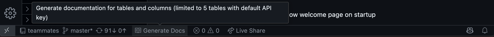
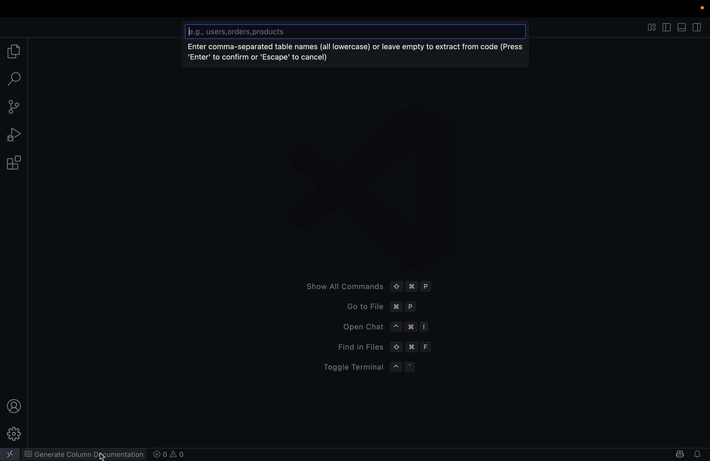
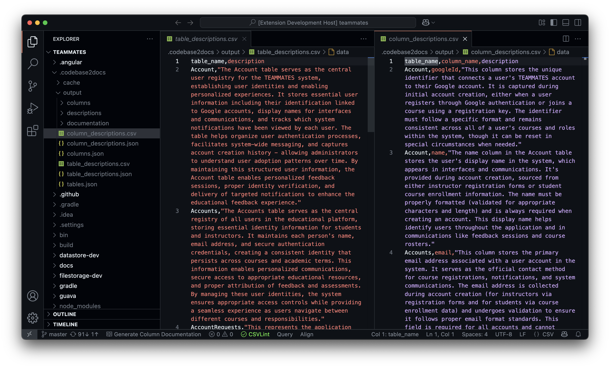

# Zingle AI

## Document the Meaning of Tables & Columns

Zingle AI automatically generates documentation for database tables and columns that are directly created or modified by your application's codebase. It helps software teams generate detailed documentation for tables and columns. Once generated, this documentation can be passed on to data teams.

### Generated table/column documentation contains:
1. ⁠How tables/columns get calculated and used in software codebases.
2. ⁠How real-world business activities update and use tables and columns, and how these activities are connected to the data in your codebase.

## 🚀 Get Started
1. Click on `Generate Column Documentation` to start generating documentation of tables/columns

2. Enter the table names (comma-separated) or leave it blank for AI to automatically figure out from codebase

3. View the generated documentation at `.codebase2docs/output/table_descriptions.csv` and `.codebase2docs/output/column_descriptions.csv`

## 🛠️ Supported Languages & Frameworks
Zingle AI works with any language or framework — no special setup required.

## 📋 Requirements

Note: Claude Code is installed automatically when you install the extension.

### For Linux / macOS
- npm
- [Claude Code](https://github.com/anthropics/claude-code)

### For Windows
- Windows Subsystem for Linux (installed manually - needed by Claude Code)
- npm
- [Claude Code](https://github.com/anthropics/claude-code)

## Notes

- The documentation generation process can take a significant amount of time (~30 mins for large codebases)
- The extension will show progress notifications and status updates
- Results are cached to avoid regenerating documentation unnecessarily

### API Key Configuration

By default, the extension comes with a limited API key that allows processing up to 5 tables. For larger projects, you should provide your own API key:

1. Get an API key from Claude (https://console.anthropic.com/)
2. Use the command "Codebase2Docs: Configure Claude API Key" from the command palette
3. Choose "Enter My Own API Key" and paste your key

## Support
Mail: atishay@getzingle.com 

Whatsapp: https://wa.me/919131266517?text=VS-Code%20Extension

Slack:  https://join.slack.com/t/zingleai/shared_invite/zt-3516obp07-zMLDwt3yX71OrqO4p6f2gQ

## License

MIT